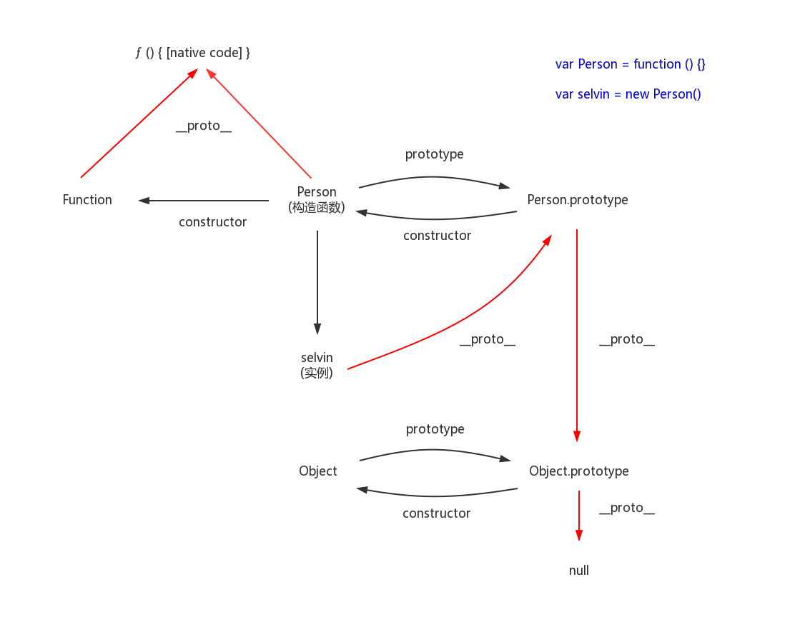

## Js-plan
A new understanding about javascript

1. [Js基本组成](#1)
2. [数据类型](#2)
3. [运算符](#operate)
4. [this](#this)
5. [单线程](#thread)
6. [数组](#array)
7. [字符串](#string)
8. [函数](#function)
9. [对象](#object)
10. [Symbol](#Symbol)
11. [Set and Map](#Set)
12. [浏览器环境](#browser)
13. [栈与堆](#stack)
14. [继承](#extend)
15. [浅拷贝/深拷贝](#copy)
16. [let && const](#let)
17. [解构赋值](#Destructuring_assignment)
18. [Iterator](#Iterator)
19. [Generator](#Generator)
20. [async](#async)


---
#### <a name="1">一. Js 基本组成</a>

* 基础语法 —— 语法、数据类型、数据类型转换、错误处理机制等
* 标准库 ——　各类广义对象及其携带的属性、方法
* DOM API
* 浏览器 API
* WEB API

---
#### <a name="2">二. Js 数据类型 </a>

> 字符串、数值、布尔值、undefined、null、对象、数组、函数、Symbol

1. 原始类型 —— 字符串、数值、布尔值
2. 合成类型 —— 对象（JavaScript的所有数据，都可以视为广义的对象
  对象分为 —— 狭义的对象（仅指Object）、数组、函数

---
#### <a name="operate">三. 运算符</a>
  * '+'  : 一般的加法运算以及重载（由于参数不同，而改变自身行为的现象，叫做“重载”）
      ```javascript
        '1' + {foo: 'bar'} // "1[object Object]"
        '1' + 1 // "11"
        '1' + true // "1true"
        '1' + [1] // "11"
      ```
  * 其余运算符（-、*、/、%等）均将符号右边转换为数值类型进行运算

---
#### <a name="this">四. this</a>

  * this返回属性或方法“当前”所在的对象。

---
#### <a name="thread">五. 单线程</a>

  一个程序运行之后便称为“进程”，进程中包含程序需要执行的各项任务，形成了任务队列，一般采用多线程来处理多项任务，线程中执行任务分为同步和异步。

  * 同步 ： 下一个任务等待上一个任务执行完成之后再执行
  * 异步 ： 任务提交请求之后，通过回调函数处理回应，从而继续执行任务，任务之间没有等待

---
#### <a name="array">六. 数组</a>

1. 数组： Js中的数组，是按照顺序排列的一组值，索引为0开始的数字，索引值可以为任意数据类型
2. 数组的方法：
  * valueOf() 

      ```
      [1,2].valueOf() // [1,2] 返回本身
      ```
  * toString()

      ```
      [1, 2, 3, [4, 5, 6]].toString() // "1,2,3,4,5,6" 返回字符串
      ```
  * push()  从数组末端添加一个或多个元素，返回值为添加后的数组长度
  * unshift()  从数组第一个个位置添加元素，返回值为添加后的数组长度
  * pop()  删除数组最后一个元素，返回值为删除的元素
  * shift()  删除数组第一个元素，返回值为删除的元素
  * join() 以参数作为分隔符，将数组成员组成一个字符串返回，原数组不变

    ```
    [1, 2, 3].join() // "1,2,3" 默认为逗号
    ```
  * concat() 数组合并，原数组不变

    ```
    [1, 2, 3].concat([4,5]) // [1,2,3,4,5] 
    [1, 2, 3].concat(4,5) // [1,2,3,4,5] 
    //如果不提供参数，concat方法返回当前数组的一个浅拷贝。
    //所谓“浅拷贝”，指的是如果数组成员包括复合类型的值（比如对象），则新数组拷贝的是该值的引用
    var obj = { a:1 };
    var oldArray = [obj];

    var newArray = oldArray.concat();

    obj.a = 2;
    newArray[0].a // 2
    ```
  * reverse() 颠倒数组中的元素顺序，返回改变后的数组，并改变原数组
  * slice(startIndex,endIndex) 返回起始到终止位置的数组

    ```
    //slice() 将类似数组的对象转化为真正的数组
    Array.prototype.slice.call({ 0: 'a', 1: 'b', length: 2 })
    // ['a', 'b']
    ```
  * splice(startIndex,deleteNum,insertElement)
  * sort() 数组排序，可以传入回调函数控制排序颗粒度
  * map() 数组遍历，对数组所有成员依次调用一个回调函数，返回新数组，原数组不变
  * foreach() 数组遍历同map()，但没有返回值，forEach方法遍历无法中断，即不能加入中断条件，这种情况可以采用for循环，第一个参数为函数，第二个参数为绑定函数的上下文（this指向）
  * filter() 数组筛选，函数作为参数，返回结果为true的成员组成一个新的数组返回，原数组不变，第一个参数为函数，第二个参数为绑定函数的上下文（this指向）

3. 数组的解构赋值：数组的元素是按照次序来排列的，变量的取值由它的位置来决定（模式匹配）。匹配失败，返回`undefined`，`var [a, b, c] = [1, 2, 3];`
    ​     

---
#### <a name="string">七. 字符串</a>

1. 字符串：可以被视为字符串数组，但无法直接调用数组的方法，可以通过`call()`调用

2. 字符集：JavaScript不仅以Unicode储存字符，还允许直接在程序中使用Unicode编号表示字符

3. Base64：是一种编码方法，可以将任意字符转成可打印字符

    JavaScript提供两种原生方法：
    * btoa()：字符串或二进制值转为Base64编码
    * atob()：Base64编码转为原来的编码

4. String的一些方法

    * charAt() 返回指定位置的字符
    * charCodeAt() 返回给定位置字符的Unicode码点
    * slice(start,end) 从原字符串取出子字符串并返回，不改变原字符串
    * substr方法用于从原字符串取出子字符串并返回，不改变原字符串。
      substr方法的第一个参数是子字符串的开始位置，第二个参数是子字符串的长度。
    * split() 按照给定规则分割字符串，返回一个由分割出来的子字符串组成的数组。
    * match()：返回一个数组，成员是所有匹配的子字符串。
    * search()：按照给定的正则表达式进行搜索，返回一个整数，表示匹配开始的位置。
    * replace()：按照给定的正则表达式进行替换，返回替换后的字符串。


---
#### <a name="function">八. 函数</a>

1. 构造函数：“对象”是单个实物的抽象。通常需要一个模板，表示某一类实物的共同特征，然后“对象”根据这个模板生成，JavaScript语言使用构造函数（constructor）作为对象的模板。

  * 函数体内部使用了this关键字，代表了所要生成的对象实例。
  * 生成对象的时候，必需用new命令，调用函数。

    ```javascript
    var Vehicle = function (){
        this.price = 1000;
    };
    // new 命令执行的操作步骤
    // 1.创建一个空对象，作为将要返回的对象实例
    // 2.将这个空对象的原型，指向构造函数的prototype属性
    // 3.将这个空对象赋值给函数内部的this关键字
    // 4.开始执行构造函数内部的代码

    //通过new命令，让构造函数Vehicle生成一个实例对象，保存在变量v中。
    //这个新生成的实例对象，从构造函数Vehicle继承了price属性。

    //若没有添加new命令，则price成为了全局变量，v.price也会报错提示undefined
    var v = new Vehicle();
    v.price // 1000
    function Vehicle(){
      //防止漏用new命令
      if (!(this instanceof Vehicle)) {
        return new Vehicle();
      }
      this.price = 1000;
    }
    ```
    ​
2. Function.prototype.call() && Function.prototype.apply() && Function.prototype.bind()

    第一个参数为函数调用的对象，后面的参数为该函数执行时需要的参数

    * 函数.call(obj,argment1,argment2...)

    * 函数.apply(obj,[argment1,argment2...])

    ```javascript
      var a = ['a', , 'b'];
      
      function print(i) {
        console.log(i);
      }
      
      a.forEach(print)
      // a
      // b
      
      Array.apply(null, a).forEach(print)
      // a
      // undefined
      // b
    ```
    * 函数.bind(obj,argment1,argment2...)  绑定this以外，还可以绑定原函数的参数。

        将函数体内的this绑定到指定的对象上
        每运行一次返回一个新函数

    ```javascript
    //自定义bind , 防止部分浏览器不支持
      if(!('bind' in Function.prototype)){
        Function.prototype.bind = function(){
          var fn = this;
          var context = arguments[0];
          var args = Array.prototype.slice.call(arguments, 1);
          return function(){
            return fn.apply(context, args);
          }
        }
      }
    ```

    prototype 原型链 

    * 读取对象属性时，先从本身开始寻找，再向对象原型寻找，逐级向上，直至到Object.prototype，返回null
    * instanceof运算符用来比较一个对象是否为某个构造函数的实例
    * prototype对象有一个constructor属性，默认指向prototype对象所在的构造函数

3. prototype ：由于 JavaScript 的所有对象都有构造函数（只有null除外），而所有构造函数都有prototype属性（其实是所有函数都有prototype属性），所以所有对象都有自己的原型对象。**prototype 属性指向了构造函数创建的实例的原型，浏览器中的__proto__（每一个对象都有的属性，除去null）指向对象的原型。**

4. constructor：对象皆有constructor属性，返回此对象的函数引用，prototype对象有一个constructor属性，默认指向prototype对象所在的构造函数。

```javascript
// 关于prototype，原型，浏览器中的__proto__属性之间的关联
// 首先定义一个Person构造函数
var Person = function () {

}
var selvin = new Person()
// Person的prototype属性指向与Person实例selvin指向同一原型
Person.prototype === selvin.__proto__  // true
```



5. 参数的解构赋值

  写法一函数参数的默认值是空对象，但是设置了对象解构赋值的默认值；
  写法二函数参数的默认值是一个有具体属性的对象，但是没有设置对象解构赋值的默认值。

  ```javascript
  // 写法一
  function m1({x = 0, y = 0} = {}) {
    return [x, y];
  }
  m1(); // 此时m1函数没有传参，及参数为空（广义的对象），则输出默认值
  // 写法二
  function m2({x, y} = { x: 0, y: 0 }) {
    return [x, y];
  }
  ```

6. 函数参数的作用域
  ```javascript
  let x = 1;

  function f(y = x) {
    let x = 2;
    console.log(y);
  }
    
  //函数f传入参数为空，函数内部没有生成变量x，因此指向了全局变量x，如果此时全局环境也没有声明x变量，则会报错
  f() // 1
  ```

7. rest 参数
  * `...变量名`，用于获取函数多余的参数，类似es5的arguments对象
  * 扩展运算符 `...`，相当于rest参数的逆运算，将一个数组转为用逗号分隔的参数序列

    ```javascript
    // ES5的写法
    var arr1 = [0, 1, 2];
    var arr2 = [3, 4, 5];
    Array.prototype.push.apply(arr1, arr2);

    // ES6的写法
    var arr1 = [0, 1, 2];
    var arr2 = [3, 4, 5];
    arr1.push(...arr2);

    //上面代码的ES5写法中，push方法的参数不能是数组，所以只好通过apply方法变通使用push方法。
    // 有了扩展运算符，就可以直接将数组传入push方法。
    ```

8. 函数的length属性

    * 指定了默认值以后，函数的length属性，将返回没有指定默认值的参数个数。也就是说，指定了默认值后，length属性将失真。

9. 箭头函数
  ```javascript
  //如果箭头函数的代码块部分多于一条语句，就要使用大括号将它们括起来，并且使用return语句返回。
  //由于大括号被解释为代码块，所以如果箭头函数直接返回一个对象，必须在对象外面加上括号。
  var getTempItem = id => ({ id: id, name: "Temp" });
  ```
  箭头函数有几个使用注意点。(箭头函数里面根本没有自己的this，而是引用外层的this。)

  （1）函数体内的this对象，就是定义时所在的对象，而不是使用时所在的对象。

  （2）不可以当作构造函数，也就是说，不可以使用new命令，否则会抛出一个错误。

  （3）不可以使用arguments对象，该对象在函数体内不存在。如果要用，可以用Rest参数代替。 

  （4）不可以使用yield命令，因此箭头函数不能用作Generator函数。

10. 函数尾递归

   * 函数调用时，会在内存中形成一个“调用记录”（调用帧），保存调用位置和调用变量等信息。
   * 如果在函数A的内部调用函数B，那么在A的调用帧上方，还会形成一个B的调用帧。等到B运行结束，将结果返回到A，B的调用帧才会消失。如果函数B内部还调用函数C，那就还有一个C的调用帧，以此类推。所有的调用帧，就形成一个“调用栈”（call stack）。
   * 尾调用由于是函数的最后一步操作，所以不需要保留外层函数的调用帧，因为调用位置、内部变量等信息都不会再用到了，只要直接用内层函数的调用帧，取代外层函数的调用帧就可以了。

     ```javascript
     function f() {
       let m = 1;
       let n = 2;
       return g(m + n);
     }
     f();

     // 等同于
     function f() {
       return g(3);
     }
     f();

     // 等同于
     g(3);
     ```
   * 上面代码中，如果函数g不是尾调用，函数f就需要保存内部变量m和n的值、g的调用位置等信息。
     但由于调用g之后，函数f就结束了，所以执行到最后一步，完全可以删除 f(x) 的调用帧，只保留 g(3) 的调用帧。

     这就叫做“尾调用优化”（Tail call optimization），即只保留内层函数的调用帧。
     如果所有函数都是尾调用，那么完全可以做到每次执行时，调用帧只有一项，这将大大节省内存。这就是“尾调用优化”的意义。

---
#### <a name="object">九. 对象</a>

1. 对象：键值对的集合，键名的数据类型均为原始类型（字符串、数字），键值可以为任意数据类型

2. 对象的引用：如果不同的变量名指向同一个对象，那么它们都是这个对象的引用，也就是说指向同一个内存地址，修改其中一个变量，会影响到其他所有变量。

3. 属性和方法的简写

  ```javascript
  //直接写入变量，变量名自动变为属性名，变量值即为变量本身。
  var foo = 'bar';
  var baz = {foo};
  baz // {foo: "bar"}

  //方法简写
  var o = {
    method() {
      return "Hello!";
    }
  };
  // 等同于
  var o = {
    method: function() {
      return "Hello!";
    }
  };

  //CommonJS模块输出变量，非常合适使用简洁写法
  module.exports = { getItem, setItem, clear };
  // 等同于
  module.exports = {
    getItem: getItem,
    setItem: setItem,
    clear: clear
  };
  ```

4. 对象的Object()方法： 如果参数是原始类型的值，Object方法返回对应的包装对象的实例，如果Object方法的参数是一个对象，它总是返回原对象。

    * Object.keys 查看一个对象本身的所有属性

      ```javascript
        var o = {
          key1: 1,
          key2: 2
        };

        Object.keys(o);
        // ['key1', 'key2']
      ```

    * Object.is(a,b) 判断两个值是否相等，修复了es5中-0与+0相等的问题，以及NaN与NaN自身不等的问题

    * Object.assign(targetobj1,sourceobj2,sourceobj3) 用于对象的合并，并返回合并之后的对象，属于浅拷贝，基于源对象的引用  

    * Object.getOwnPropertyDescriptor

      对象的每个属性都有一个可描述对象，此方法就是获取该属性的描述对象
      ```javascript
        let obj = { foo: 123 };
        Object.getOwnPropertyDescriptor(obj, 'foo')
        //  {
        //    value: 123,
        //    writable: true,
        //    enumerable: true,
        //    configurable: true
        //  }
      ```

5. 对象的解构赋值: 对象的属性没有次序，变量名必须与属性同名，才能取到正确的值。
  ```javascript
  //简写形态
  var { foo, bar } = { foo: "aaa", bar: "bbb" };
  foo // "aaa"
  bar // "bbb"
  //原始形态
  var { foo: foo, bar: bar } = { foo: "aaa", bar: "bbb" };
  // foo 是匹配的模式 ， foo：后的foo才是变量，真正被赋值的是变量

  //嵌套模式下的对象解构 (对象中的对象（狭义对象，数组，函数）)
  var obj = {
    p: [
      'Hello',
      { y: 'World' }
    ]
  };
      //注意，这时p是模式，不是变量，因此不会被赋值。
  var { p: [x, { y }] } = obj;
  x // "Hello"
  y // "World"
  ```


---
#### <a name="Symbol">十. Symbol</a>

1. 防止命名冲突

  ```javascript
  let s = Symbol();

  typeof s
  // "symbol"
  //由于每一个Symbol值都是不相等的，
  // 这意味着Symbol值可以作为标识符，用于对象的属性名，
  // 就能保证不会出现同名的属性。
  // 这对于一个对象由多个模块构成的情况非常有用，能防止某一个键被不小心改写或覆盖。
  ```

---
#### <a name="Set">十一. Set and Map</a>

1. ES6提供了新的数据结构Set。它类似于数组，但是成员的值都是唯一的，没有重复的值。

2. JavaScript的对象（Object），本质上是键值对的集合（Hash结构），但是传统上只能用字符串当作键。

  ```javascript
  var data = {};
  var element = document.getElementById('myDiv');

  data[element] = 'metadata';
  data['[object HTMLDivElement]'] // "metadata"

  //上面代码原意是将一个DOM节点作为对象data的键，但是由于对象只接受字符串作为键名，所以element被自动转为字符串[object HTMLDivElement]。
  //为了解决这个问题，ES6提供了Map数据结构。
  //它类似于对象，也是键值对的集合，但是“键”的范围不限于字符串，各种类型的值（包括对象）都可以当作键。
  //也就是说，Object结构提供了“字符串—值”的对应，Map结构提供了“值—值”的对应，是一种更完善的Hash结构实现。
  //如果你需要“键值对”的数据结构，Map比Object更合适。
  ```

---
#### <a name="browser">十二. 浏览器环境</a>

* script
* window对象
* History对象
* cookie
* Web Storage
* AJAX 同源政策 跨域
* IndexDB

---
#### <a name="stack">十三. 栈与堆</a>

* 栈 ：有唯一编号的乒乓球，以及一个出口的圆筒乒乓球盒，栈的存取方式 根据乒乓球编号，依次拿出顶部乒乓球，直到拿到此编号的乒乓球 => 先进后出，后进先出

* 堆 ：水平放置于书架上的书，书架 => 书 （key=>value），堆的存取方式 根据书名取出此书即可，无序

* Js代码逐行执行时，执行上下文（当前代码的执行环境（1.全局上下文；2.当前函数上下文；3.eval()））进出栈详解：

  首先全局上下文入栈，其次遇到函数时，当前函数执行上下文入栈，
  函数中又遇到函数，继续将当前函数执行上下文入栈，以此类推
  直至全部函数执行完毕，
  根据栈的顺序，最顶层的函数上下文依次出栈(被浏览器垃圾回收机制回收)，（先进后出，后进先出）
  栈底就只有全局上下文，关闭浏览器时，全局上下文出栈

  * 单线程
  * 同步执行，只要栈顶的上下文处于执行中，其他上下文需要等待
  * 全局上下文只有唯一的一个，它在浏览器关闭时出栈
  * 函数的执行上下文的个数没有限制
  * 每次某个函数被调用，就会有个新的执行上下文为其创建，即使是调用的自身函数，也是如此。

* 执行上下文都干了什么：

    简单描述：进入执行上下文后，首先创建变量对象，函数声明提升，变量声明（有值则跳过，无值则undefined），接着进入执行阶段，变量对象变为活动对象，活动对象中的属性及属性值能够访问，开始逐行执行代码，完成相关操作。

    当调用一个函数时（激活），一个新的执行上下文就会被创建。而一个执行上下文的生命周期可以分为两个阶段。

    1. 创建阶段：在这个阶段中，执行上下文会分别创建`变量对象`，建立`作用域链`，以及确定`this的指向`

    * 变量对象：
      (1) 建立arguments对象。检查当前上下文中的参数，建立该对象下的属性与属性值。

      (2) 检查当前上下文的函数声明，也就是使用function关键字声明的函数。在变量对象中以函数名建立一个属性，属性值为指向该函数所在内存地址的引用。如果函数名的属性已经存在，那么该属性将会被新的引用所覆盖。

      (3) 检查当前上下文中的变量声明，每找到一个变量声明，就在变量对象中以变量名建立一个属性，属性值为undefined。如果该变量名的属性已经存在，为了防止同名的函数被修改为undefined，则会直接跳过，原属性值不会被修改。

    * 作用域链：是由当前环境与上层环境的一系列变量对象组成，它保证了当前执行环境对符合访问权限的变量和函数的有序访问。

      ```javascript
      var a = 20;

      function test() {
        var b = a + 10;

        function innerTest() {
            var c = 10;
            return b + c;
        }

        return innerTest();
      }

      test();
      ```

      ```javascript
      //  在上面的例子中，全局，函数test，函数innerTest的执行上下文先后创建。
      //　我们设定他们的变量对象分别为VO(global)，VO(test), VO(innerTest)。
      //  而innerTest的作用域链，则同时包含了这三个变量对象，所以innerTest的执行上下文可如下表示。
      innerTestEC = {
          VO: {...},  // 变量对象
          scopeChain: [VO(innerTest), VO(test), VO(global)], // 作用域链
          this: {}
      }
      ```

    * this指向：是在函数被调用的时候确定的。
      **当函数调用时不被对象（非全局对象）拥有时，则此函数为独立调用，在严格模式下this指向undefined**
      * 全局对象中的this：指向全局对象本身
      * 对象属性中的this：此处特指对象在全局声明，this在非严格模式指向全局对象，严格模式指向undefined
      * 函数中的this：
        在一个函数上下文中，this由调用者提供，由调用函数的方式来决定。
        如果调用者函数，被某一个对象所拥有，那么该函数在调用时，内部的this指向该对象。
        如果函数独立调用，那么该函数内部的this，则指向undefined。
        但是在非严格模式中，当this指向undefined时，它会被自动指向全局对象。

        ```javascript
        // 为了能够准确判断，我们在函数内部使用严格模式，因为非严格模式会自动指向全局
        function fn() {
          'use strict';
          console.log(this);
        }

        fn();  // fn是独立调用
        window.fn();  // fn被window对象（window执行上下文中的变量对象）所拥有，非独立调用
        ```

      * **函数中声明的对象中的this**

          ```javascript 
          'use strict';
          // 当obj在全局声明时，无论obj.c在什么地方调用，这里的this都指向全局对象，
          // 而当obj在函数环境中声明时，这个this指向undefined，在非严格模式下，会自动转向全局对象
          var a = 20;
          function foo () {
            var a = 1;
            var obj = {
              a: 10, 
              c: this.a + 20, // this指向undefined，严格模式下报错
              fn: function () {
                  return this.a;
              }
            }
            return obj.c;
          }
          console.log(foo()); // 运行会报错
          ```

    2. 代码执行阶段：创建完成之后，就会开始执行代码，这个时候，会完成`变量赋值`，`函数引用`，以及执行其他代码。
    3. 进入执行阶段后，变量对象变为活动对象：里面的属性都能被访问了，然后开始进行执行阶段的操作。


* 作用域和闭包

1. 作用域：

    * 在JavaScript中，我们可以将作用域定义为一套规则,这套规则用来管理引擎如何在当前作用域以及嵌套的子作用域中根据标识符名称（变量名或者函数名）进行变量查找。

    * JavaScript中只有全局作用域与函数作用域(因为eval我们平时开发中几乎不会用到它)。

    * 作用域与执行上下文是完全不同的两个概念。

    JavaScript代码的整个执行过程，分为两个阶段，代码编译阶段与代码执行阶段。
    编译阶段由编译器完成，将代码翻译成可执行代码，这个阶段作用域规则会确定。
    执行阶段由引擎完成，主要任务是执行可执行代码，执行上下文在这个阶段创建。

2. 闭包：当一个函数可以记住并访问所在的作用域（全局作用域除外），并在定义该函数的作用域之外执行时，该函数就可以称之为一个闭包。（假设函数A在函数B的内部进行定义了，并在函数B的作用域之外执行（不管是上层作用域，下层作用域，还有其他作用域），那么A就是一个闭包）

  ```javascript
  var fn = null;
  function foo() {
      var a = 2;
      function innnerFoo() { 
          console.log(a);
      }
      fn = innnerFoo; // 将 innnerFoo的引用，赋值给全局变量中的fn
  }

  function bar() {
      fn(); // 此处的保留的innerFoo的引用
  }

  foo();
  bar(); // 2
  //foo()执行完毕之后，按照常理，其执行环境生命周期会结束，所占内存被垃圾收集器释放。
  //但是通过fn = innerFoo，函数innerFoo的引用被保留了下来，复制给了全局变量fn。
  //这个行为，导致了foo的变量对象，也被保留了下来。
  //于是，函数fn在函数bar内部执行时，依然可以访问这个被保留下来的变量对象。
  //所以此刻仍然能够访问到变量a的值。

  //这样，我们就可以称fn为闭包。(fn本身的执行环境实在foo的函数上下文，实际的执行环境是在bar函数的上下文)

  //虽然例子中的闭包被保存在了全局变量中，但是闭包的作用域链并不会发生任何改变。
  //在闭包中，能访问到的变量，仍然是作用域链上能够查询到的变量。
  ```

* Js内存空间和垃圾回收机制

    * JavaScript基本上所有数据都保存在堆内存中，但执行上下文则是栈数据的体。

    基础类型的数据都是直接保存在变量对象（也是保存在堆内存）中，是按值访问的，可以直接操作，都是复制独立的；

    引用类型的数据都是保存在堆内存的对象中，在创建变量对象时，保存的是堆内存中对象的引用地址，只能操作其对象的引用，因此当我们要访问堆内存中的引用数据类型时，实际上我们首先是从变量对象中获取了该对象的地址引用（或者地址指针），然后再从堆内存中取得我们需要的数据

    * 垃圾回收机制：通过标记清除的算法，找出不再使用的对象（变量对象或者堆内存中的对象失去引用时），
      解除引用并释放

---
#### <a name="extend">十四. 继承</a>​    

1. 构造函数的实例对象 && 原生对象 的继承有何不同，以Object.create()方法为例分析

  * 构造函数的实例对象

      ```javascript
      var Chinese = function(){
          this.nation = '中国';
      };
      // 构造函数new生成的实例对象
      var china = new Chinese();

      // 使用Object.create（）函数原理进行继承
      function object(o){
          function F () {};
          F.prototype = o;
          return new F();
      }

      Doctor = object(china);
      Doctor 控制台打印如下：
      //F
        __proto__:Chinese
          nation:"中国"
          __proto__:Object
            constructor:()
              arguments:null
              caller:null
              length:0
              name:"Chinese"
            prototype:Object
            __proto__:()
            [[FunctionLocation]]:index.html:22
            [[Scopes]]:Scopes[1]
          __proto__:Object

      Doctor.__proto__ 控制台打印如下：
      //Chinese
          nation: "中国"
          __proto__:Object
            constructor:()
              arguments:null
              caller:null
              length:0
              name:"Chinese"
            prototype:Object
            __proto__:()
            [[FunctionLocation]]:index.html:22
            [[Scopes]]:Scopes[1]
          __proto__:Object
      ```

  * 原生对象

      ```javascript

        var Chinese = {
            nation : '中国';
        };
        
        // 使用Object.create（）函数原理进行继承
        function object(o){
            function F () {};
            F.prototype = o;
            return new F();
        }
        
        Doctor = object(Chinese);
        Doctor 控制台打印如下：
        //F
          __proto__:Chinese
            nation:"中国"
            __proto__:Object
        
        Doctor.__proto__ 控制台打印如下：
        //Object
            nation: "中国"
            __proto__:Object
      ```

  * 由此可以看出，两者对象继承之后，它们的原型链不同，构造函数生成的实例对象
    比原生对象多了一层对象实例

---
#### <a name="copy">十五. 浅拷贝／深拷贝</a>​    

* 浅拷贝

  ```javascript
  function extendCopy(p) {
    var c = {};
    for (var i in p) { 
      c[i] = p[i];
    }
    c.uber = p;
    return c;
  }
  ```

* 深拷贝

  ```javascript
  function deepCopy(p, c) {
    var c = c || {};
    for (var i in p) {
      //当为对象或者数组时对其进行函数递归，即深度拷贝（复制值，非值的地址引用）
      if (typeof p[i] === 'object') {
        c[i] = (p[i].constructor === Array) ? [] : {};
        deepCopy(p[i], c[i]);
      } else {
        c[i] = p[i];
    　}
    }
    return c;
  }
  ```

---
#### <a name="let">十六. let && const</a>​  

* let

  1. 不存在变量提升（在声明之前调用变量，会报错）
  2. 暂时性死区（只要块级作用域内存在let命令，它所声明的变量就“绑定”（binding）这个区域，不再受外部的影响，在let声明变量前的区域均为块级作用域，进行任何此变量的操作都会报错）
  ```javascript
  // es5中不存在块级作用域，f()执行后，逐行执行代码，寻找当前执行上下文中声明的`tmp`变量，发现未被声明，因此显示undefined
    var tmp = new Date();

    function f() {
      console.log(tmp);
      if (false) {
        var tmp = "hello world";
      }
    }

    f(); // undefined
  ```
  3. 不允许重复声明

* const

  1. 常量一旦声明，常量的值就不能改变
  2. 作用域和其它特点和`let`一致
  3. 本质：`const`声明后的变量，其实是保证变量保存在内存中的地址不得改变或被引用，因此实现了值不得更改


---
#### <a name="Destructuring_assignment">十七. 解构赋值</a>​  

* 区分模式和真正被赋值的变量
  ```javascript
  //let { x: x, y: y } = { x: "aaa", y: "bbb" }; 以下是此形式的简写
    左边第一个x表示匹配模式（相当于正则），冒号后面的x才是被赋值的变量
  var {x:y = 3} = {};// x为匹配模式，y为变量
  y // 3

  var {x:y = 3} = {x: 5};// x为匹配模式，y为变量
  y // 5
  ```
* 记住赋值顺序，右边的值赋给左边定义的变量
* 可使用默认值
* 数据类型间的解构赋值稍有差异，具体参照上面的分类进行查看

---
#### <a name="Iterator">十八. Iterator</a>​

1. Iterator的作用：
  * 为各种数据结构，提供一个统一的、简便的访问接口；
  * 使得数据结构的成员能够按某种次序排列；
  * ES6创造了一种新的遍历命令for...of循环，Iterator接口主要供for...of消费。

2. Iterator的遍历过程：

（1）创建一个指针对象，指向当前数据结构的起始位置。也就是说，遍历器对象本质上，就是一个指针对象。

（2）第一次调用指针对象的next方法，可以将指针指向数据结构的第一个成员。

（3）第二次调用指针对象的next方法，指针就指向数据结构的第二个成员。

（4）不断调用指针对象的next方法，直到它指向数据结构的结束位置。

3. 默认
  * Iterator 接口的目的，就是为所有数据结构，提供了一种统一的访问机制，即for...of循环。当使用for...of循环遍历某种数据结构时，该循环会自动去寻找 Iterator 接口。

  * 一种数据结构只要部署了 Iterator 接口，我们就称这种数据结构是”可遍历的“（iterable）。

  * ES6 规定，默认的 Iterator 接口部署在数据结构的Symbol.iterator属性，或者说，一个数据结构只要具有Symbol.iterator属性，就可以认为是“可遍历的”（iterable）。Symbol.iterator属性本身是一个函数，就是当前数据结构默认的遍历器生成函数。执行这个函数，就会返回一个遍历器。至于属性名Symbol.iterator，它是一个表达式，返回Symbol对象的iterator属性，这是一个预定义好的、类型为 Symbol 的特殊值，所以要放在方括号内。

  * 原生具备 Iterator 接口的数据结构如下

    * Array
    * Map
    * Set
    * String
    * TypedArray
    * 函数的 arguments 对象
    * NodeList 对象


---
#### <a name="Generator">十九. Generator</a>​

1. 定义：Generator 函数除了状态机，还是一个遍历器对象生成函数。返回的遍历器对象，可以依次遍历 Generator 函数内部的每一个状态。

2. 执行器：用于 Generator 函数的自动流程管理。

---
#### <a name="asnyc">二十. asnyc</a>​

1. 简介：简化异步操作而生，Generator函数的语法糖。

  * 内置执行器
  * 更好的语义：async和await，比起星号和yield，语义更清楚了。async表示函数里有异步操作，await表示紧跟在后面的表达式需要等待结果。
  * 更广的适用性：co模块约定，yield命令后面只能是 Thunk 函数或 Promise 对象，而async函数的await命令后面，可以是Promise 对象和原始类型的值（数值、字符串和布尔值，但这时等同于同步操作）。
  * 返回值是Promise

2. 语法
  * 返回Promise对象：async函数返回一个 Promise 对象，async函数内部return语句返回的值，会成为then方法回调函数的参数。
  * Promise 对象的状态变化
    * async函数返回的 Promise 对象，必须等到内部所有await命令后面的 Promise 对象执行完，才会发生状态改变，除非遇到return语句或者抛出错误。
    * 也就是说，只有async函数内部的异步操作执行完，才会执行then方法指定的回调函数。
  * await 命令
    * 正常情况下，await命令后面是一个 Promise 对象。如果不是，会被转成一个立即resolve的 Promise 对象。
    * 只要一个await语句后面的 Promise 变为reject，那么整个async函数都会中断执行。

3. 实例
  * 依次远程读取一组 URL，然后按照读取的顺序输出结果。

      ```javascript
      async function logInOrder(urls) {
        for (const url of urls) {
          const response = await fetch(url);
          console.log(await response.text());
        }
        // 所有请求间属于继发关系，请求需要并发执行，输出按照顺序即可
      }
      ```
      改造版：虽然map方法的参数是async函数，但它是并发执行的，因为只有async函数内部是继发执行，外部不受影响。后面的for..of循环内部使用了await，因此实现了按顺序输出。
      ```javascript
      async function logInOrder(urls) {
        // 并发读取远程URL
        const textPromises = urls.map(async url => {
          const response = await fetch(url);
          return response.text();
        });

        // 按次序输出
        for (const textPromise of textPromises) {
          console.log(await textPromise);
        }
      }
      ```